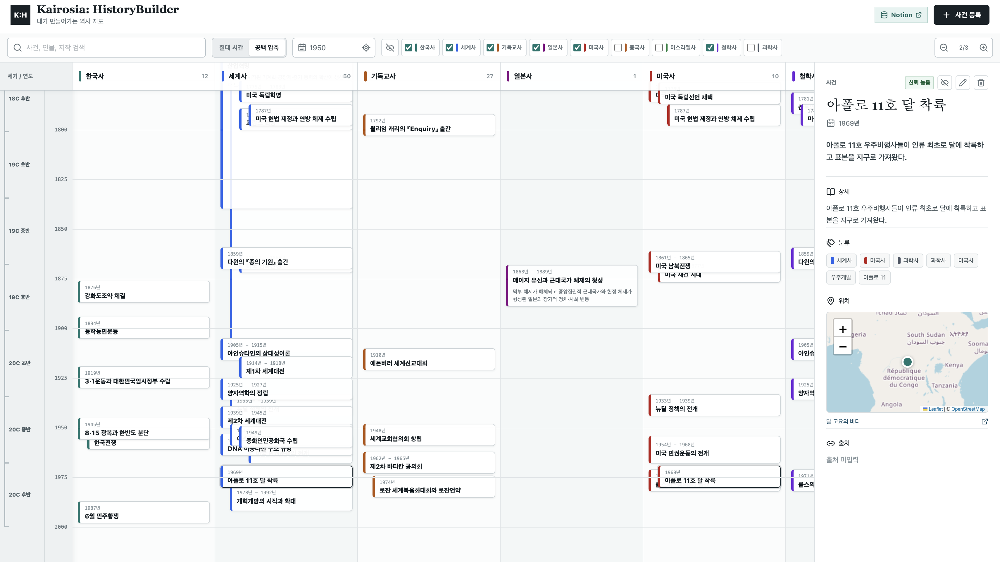
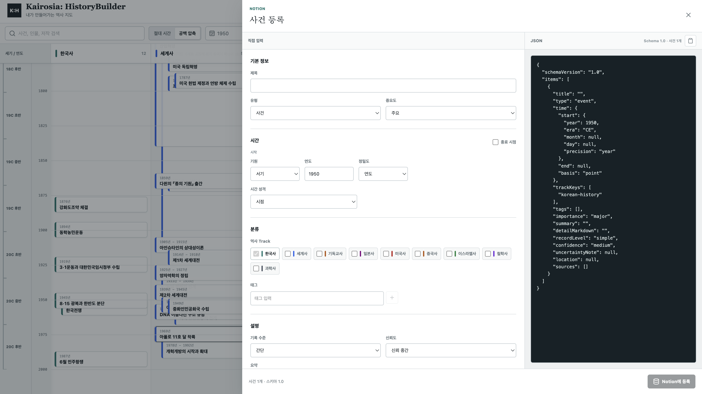
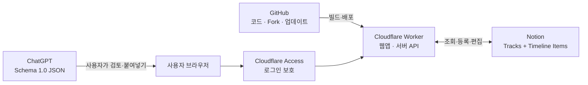

# Kairosia: HistoryBuilder

> Notion에 기록한 여러 분야의 역사를 하나의 시간축에서 비교하고, 직접 또는 JSON으로 사건을 계속 쌓아가는 개인 역사 지도입니다.

[English](./README.md) · [기획 문서](./BRAIDED_HISTORY_PLAN.md) · [MIT License](./LICENSE)

[](https://deploy.workers.cloudflare.com/?url=https://github.com/Gie-ok-Hie-ut/kairosia-history-builder)



## 한눈에 보기

Kairosia는 연도가 적힌 사건 목록이 아니라, **서로 다른 역사가 같은 시기에 어떻게 겹쳤는지** 보기 위한 도구입니다.

1. **트랙** 메뉴에서 화면에 표시할 분야를 고르고, 손잡이를 드래그해 연표 열 순서를 바꿉니다. 순서는 Notion에 저장되고 표시 여부는 현재 브라우저의 개인 설정으로 남습니다.
2. 사건을 눌러 상세 내용을 확인하거나 북마크하고, 관심 사건만 모아봅니다.
3. 여섯 단계로 확대합니다. 정확한 월·일이 있는 사건은 한 해 안에서도 서로 다른 위치에 놓이고 최대 확대에서는 분기 눈금이 나타납니다.
4. 새 사건을 직접 입력하거나 ChatGPT가 만든 약속된 JSON을 붙여넣습니다.
5. 확인된 데이터만 Notion에 저장되고, 연표는 그 내용을 다시 읽어 표시합니다.

Notion이 원본 데이터이므로 별도의 데이터베이스 서버를 운영할 필요가 없습니다. 사건을 편집하거나 북마크하고 숨기거나 삭제하면 연결된 Notion에도 같은 변경이 반영됩니다.

## 사건 등록



왼쪽 직접 입력 폼과 오른쪽 JSON 편집기는 **같은 사건 하나**를 실시간으로 공유합니다. 직접 입력하면 JSON이 바뀌고, 유효한 JSON을 붙여넣으면 폼이 바뀝니다. 중복과 스키마 오류를 확인한 뒤 **Notion에 등록**을 누릅니다.

ChatGPT와 Kairosia가 직접 연결되는 구조는 아닙니다. ChatGPT에는 [`Schema 1.0`](./domain/import/schema.ts)에 맞는 사건 하나를 요청하고, 사용자가 내용을 검토해 JSON 편집기에 붙여넣습니다. 따라서 AI가 임의로 Notion을 수정하지 않습니다.

## 전체 구조



| 구성 | 맡는 역할 | 필요한 이유 |
|---|---|---|
| **Notion** | Track과 사건의 원본 저장 | 익숙한 화면에서 데이터를 직접 확인하고 관리하기 위해 |
| **Cloudflare Workers** | 웹앱 실행, Notion API 호출, secret 보관 | Notion token을 브라우저나 GitHub에 노출하지 않기 위해 |
| **Cloudflare Access** | 앱 로그인과 관리자 이메일 확인 | 개인 Notion을 연결한 앱을 외부 요청으로부터 보호하기 위해 |
| **GitHub** | 코드 공개, Fork, 변경 이력과 자동 배포 | 누구나 자기 복사본을 만들고 업데이트할 수 있게 하기 위해 |

GitHub Pages만으로는 Notion secret과 서버 API를 안전하게 처리할 수 없습니다. 그래서 GitHub에는 코드를 두고, 무료로 시작할 수 있는 Cloudflare Worker에서 앱을 실행합니다.

## 설치 요약

처음 설치할 때 필요한 작업은 다음 다섯 단계입니다.

1. Notion에 `Tracks`와 `Timeline Items` 데이터베이스를 만듭니다.
2. Notion Connection을 만들고 두 데이터베이스에 연결합니다.
3. 위의 **Deploy to Cloudflare** 버튼으로 자기 GitHub 저장소와 Worker를 만듭니다.
4. Notion token, 두 data source ID, 관리자 이메일을 Cloudflare secret으로 넣습니다.
5. Cloudflare Access로 Worker 전체를 보호한 뒤 발급된 `*.workers.dev` 주소를 엽니다.

아래는 각 단계의 상세 설명입니다.

## 상세 설치

### 1. Notion 준비

#### Connection 만들기

1. [Notion Connections](https://www.notion.so/profile/integrations)에서 내부 Connection을 만듭니다.
2. 인증 방식은 개인 워크스페이스용 **Access token**을 선택합니다.
3. **Read content**, **Insert content**, **Update content** 권한을 허용합니다.
4. 발급된 token을 보관합니다. 이 값이 `NOTION_API_KEY`입니다.

#### 데이터베이스 두 개 만들기

Notion에 전체 페이지 데이터베이스 두 개를 만들고 이름을 각각 `Tracks`, `Timeline Items`로 지정합니다. 속성 이름은 아래 표와 정확히 같아야 합니다.

<details>
<summary><strong>Tracks 속성 펼치기</strong></summary>

| 속성 | Notion 타입 |
|---|---|
| `Name` | Title |
| `Key` | Rich text |
| `Order` | Number |
| `Color` | Select |
| `Parent` | 같은 Tracks 데이터 소스 Relation |
| `Visible` | Checkbox |
| `Description` | Rich text |

`Color`에는 `teal`, `blue`, `amber`, `red`, `purple`, `violet`, `green`, `gray` 또는 CSS 색상 문자열을 사용합니다.

</details>

<details>
<summary><strong>Timeline Items 속성 펼치기</strong></summary>

| 속성 | Notion 타입 |
|---|---|
| `Title` | Title |
| `Type`, `StartEra`, `EndEra`, `StartPrecision`, `EndPrecision`, `TimeBasis` | Select |
| `Importance`, `RecordLevel`, `Confidence`, `Status` | Select |
| `StartYear`, `StartMonth`, `StartDay`, `EndYear`, `EndMonth`, `EndDay` | Number |
| `Tracks` | Tracks 데이터 소스 Relation |
| `RelatedItems` | 같은 Timeline Items 데이터 소스 Relation |
| `Tags` | Multi-select |
| `Bookmarked` | Checkbox |
| `Summary`, `UncertaintyNote`, `Slug`, `ImportFingerprint`, `PlaceName` | Rich text |
| `Latitude`, `Longitude` | Number |
| `LocationPrecision` | Select |

기본 연표에는 `Status=Published`인 사건만 나타납니다. `Hidden`은 눈 토글을 켰을 때만 보이고 `Draft`는 연표에 표시되지 않습니다. 기존 설치에 `Bookmarked`가 없으면 첫 북마크 변경 때 Kairosia가 체크박스 속성을 자동으로 만듭니다.

</details>

#### Connection과 ID 연결하기

1. 두 데이터베이스 각각에서 `•••` 메뉴를 열고 **Add connections**에서 만든 Connection을 추가합니다.
2. 데이터베이스 설정의 **Manage data sources**를 엽니다.
3. 실제 데이터 소스의 `•••` 메뉴에서 **Copy data source ID**를 선택합니다.
4. Tracks ID와 Timeline Items ID를 따로 보관합니다.

데이터베이스 URL의 database ID와 data source ID는 서로 다릅니다. 자세한 위치는 [Notion 공식 안내](https://developers.notion.com/reference/retrieve-a-data-source#finding-a-data-source-id)를 참고하세요. Relation으로 연결한 양쪽 데이터베이스 모두 Connection에 공유해야 합니다.

### 2. Cloudflare에 배포

[](https://deploy.workers.cloudflare.com/?url=https://github.com/Gie-ok-Hie-ut/kairosia-history-builder)

버튼을 누르면 Cloudflare가 이 저장소를 사용자의 GitHub 계정으로 복사하고 Worker를 빌드합니다. 배포 화면에서 다음 네 값을 입력합니다.

| 환경변수 | 값 |
|---|---|
| `NOTION_API_KEY` | Notion Connection token |
| `NOTION_TRACKS_DATA_SOURCE_ID` | Tracks data source ID |
| `NOTION_ITEMS_DATA_SOURCE_ID` | Timeline Items data source ID |
| `ADMIN_EMAILS` | 편집을 허용할 이메일. 여러 명이면 쉼표로 구분 |

이 값들은 GitHub가 아니라 Cloudflare Worker secret으로 저장해야 합니다. `NOTION_WEBHOOK_TOKEN`은 webhook을 사용할 때만 선택적으로 추가합니다.

Cloudflare 계정을 처음 쓴다면 이메일 인증과 `workers.dev` 서브도메인 등록을 요구할 수 있습니다. 안내에 따라 한 번만 설정하면 됩니다.

### 3. Access로 앱 보호

개인 Notion을 연결하므로 현재 권장 설정은 **앱 전체를 비공개로 보호**하는 것입니다.

1. Cloudflare에서 **Zero Trust Free**를 활성화합니다.
2. **Workers & Pages → 해당 Worker → Access**로 이동합니다.
3. **Protect this Worker behind Access**를 누릅니다.
4. **All traffic**과 **Cloudflare account** 정책을 선택합니다.
5. Access 로그인 이메일이 `ADMIN_EMAILS`와 정확히 같은지 확인합니다.

Access를 적용하기 전에는 Worker 주소를 공유하지 마세요. Worker 화면에서 Access 탭이 잘리면 상단 `Domains` 오른쪽의 `Ac…` 또는 탭 줄의 화살표를 누르면 됩니다.

### 4. 첫 실행 확인

발급된 `https://<worker>.<subdomain>.workers.dev` 주소를 엽니다.

1. Cloudflare Access로 로그인됩니다.
2. 우측 상단 **Notion** 배지를 누르면 연결된 Timeline Items 데이터베이스가 열립니다.
3. 기존 Notion 사건이 연표에 보이는지 확인합니다.
4. 테스트 사건 하나를 등록하고 편집·숨김·복원이 Notion에 반영되는지 확인합니다.

## 로컬에서 먼저 실행하기

Node.js `>=22.13.0`이 필요합니다.

```bash
git clone https://github.com/Gie-ok-Hie-ut/kairosia-history-builder.git
cd kairosia-history-builder
npm install
cp .env.example .env.local
npm run dev
```

브라우저에서 [http://localhost:3000](http://localhost:3000)을 엽니다. `.env.local`에 Notion 값을 넣지 않으면 안전한 샘플 데이터로 실행됩니다.

```dotenv
NOTION_API_KEY=ntn_...
NOTION_TRACKS_DATA_SOURCE_ID=...
NOTION_ITEMS_DATA_SOURCE_ID=...
ADMIN_EMAILS=you@example.com
```

직접 Cloudflare에 배포할 때는 다음 명령을 사용합니다.

```bash
npm run deploy:local
```

## 자주 막히는 부분

| 증상 | 확인할 것 |
|---|---|
| 샘플 데이터만 보임 | Notion secret 세 개가 모두 설정됐는지 확인 |
| Notion API `404` | 두 원본 데이터베이스를 Connection에 공유했는지, data source ID가 맞는지 확인 |
| 등록·편집이 `403` | Cloudflare Access 이메일과 `ADMIN_EMAILS`가 같은지 확인 |
| 사건이 저장됐지만 연표에 없음 | Notion의 `Status`가 `Published`인지 확인 |
| 지도는 보이지만 Google API key가 없음 | 정상 동작. Leaflet과 OpenStreetMap을 사용하며 위치 링크만 Google Maps로 연결 |

## 선택 사항

한국사 시대 골격과 기독교·이스라엘사, 동아시아사, 유럽사, 미국사, 중국사, 철학사, 과학사의 핵심 사건을 넣을 수 있습니다.

```bash
npm run seed:core
```

기존 `일본사` Track은 `동아시아사`로 전환되고, `이스라엘사`는 `기독교·이스라엘사`로 관계가 통합됩니다. 성경사 데이터는 복음주의 개신교의 정경 서사와 전통적 연대를 기준으로 하며, 논쟁적인 연대는 `disputed`로 표시합니다.

## 개발과 검증

```bash
npm run typecheck
npm run lint
npm test
```

구현 배경과 세부 설계는 [기획 문서](./BRAIDED_HISTORY_PLAN.md), 실제 JSON 계약은 [`domain/import/schema.ts`](./domain/import/schema.ts)에 있습니다.

## License

[MIT](./LICENSE)
