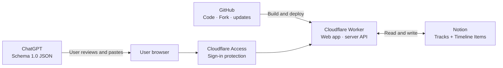

# Kairosia: HistoryBuilder

> A personal history map that compares multiple fields on one timeline and lets you keep building the dataset in Notion, either manually or with reviewed JSON.

[한국어](./README.ko.md) · [Planning document](./BRAIDED_HISTORY_PLAN.md) · [MIT License](./LICENSE)

[](https://deploy.workers.cloudflare.com/?url=https://github.com/Gie-ok-Hie-ut/kairosia-history-builder)


## At a glance

Kairosia is designed to show **what was happening across different histories at the same time**, rather than presenting another isolated list of dates.

1. Select visible columns from the **Tracks** menu, then drag their handles to reorder the timeline. The order is saved to Notion, while visibility remains a personal browser preference.
2. Open an event to inspect its details or bookmark it for a focused personal view.
3. Zoom through six levels. Exact month and day values occupy distinct positions within a year, with quarterly axis labels at the highest level.
4. Add one event with the direct form or paste schema-compliant JSON produced by ChatGPT.
5. Only reviewed data is written to Notion, and the timeline renders that source data.

Notion remains the source of truth, so there is no separate database server to maintain. Editing, bookmarking, hiding, restoring, or deleting an event updates the connected Notion record.

## Registering an event


The direct form and JSON editor represent **the same single event**. Form changes are serialized to JSON immediately; valid JSON updates the form. Review schema and duplicate warnings, then select **Register in Notion**.

ChatGPT is not directly connected to Kairosia. Ask it for one event matching [`Schema 1.0`](./domain/import/schema.ts), review the result, and paste it into the editor. This prevents an AI service from changing Notion without your approval.

## Architecture



| Service | Responsibility | Why it is needed |
|---|---|---|
| **Notion** | Source data for tracks and events | Lets you inspect and manage your history data in a familiar interface |
| **Cloudflare Workers** | Runs the app, calls Notion, stores secrets | Keeps the Notion token out of browsers and GitHub |
| **Cloudflare Access** | Authenticates app visitors and admin email | Protects the app connected to your personal Notion workspace |
| **GitHub** | Public source, forks, history, and deployments | Lets anyone create and maintain an independent copy |

GitHub Pages alone cannot securely hold a Notion token or run the editing APIs. The code therefore lives on GitHub while the full-stack app runs on a Cloudflare Worker.

## Installation overview

1. Create `Tracks` and `Timeline Items` databases in Notion.
2. Create a Notion connection and share both databases with it.
3. Select **Deploy to Cloudflare** to create your own repository and Worker.
4. Add the Notion token, both data source IDs, and your admin email as Worker secrets.
5. Protect all Worker traffic with Cloudflare Access, then open the assigned `*.workers.dev` URL.

The detailed steps follow.

## Detailed setup

### 1. Prepare Notion

#### Create a connection

1. Create an internal connection from [Notion Connections](https://www.notion.so/profile/integrations).
2. Use **Access token** authentication for a personal workspace.
3. Grant **Read content**, **Insert content**, and **Update content** capabilities.
4. Keep the issued token as `NOTION_API_KEY`.

#### Create two databases

Create two full-page Notion databases named `Tracks` and `Timeline Items`. Property names must match the following tables exactly.

<details>
<summary><strong>Tracks properties</strong></summary>

| Property | Notion type |
|---|---|
| `Name` | Title |
| `Key` | Rich text |
| `Order` | Number |
| `Color` | Select |
| `Parent` | Relation to the same Tracks data source |
| `Visible` | Checkbox |
| `Description` | Rich text |

Use `teal`, `blue`, `amber`, `red`, `purple`, `violet`, `green`, `gray`, or a CSS color string for `Color`.

</details>

<details>
<summary><strong>Timeline Items properties</strong></summary>

| Property | Notion type |
|---|---|
| `Title` | Title |
| `Type`, `StartEra`, `EndEra`, `StartPrecision`, `EndPrecision`, `TimeBasis` | Select |
| `Importance`, `RecordLevel`, `Confidence`, `Status` | Select |
| `StartYear`, `StartMonth`, `StartDay`, `EndYear`, `EndMonth`, `EndDay` | Number |
| `Tracks` | Relation to the Tracks data source |
| `RelatedItems` | Relation to the same Timeline Items data source |
| `Tags` | Multi-select |
| `Bookmarked` | Checkbox |
| `Summary`, `UncertaintyNote`, `Slug`, `ImportFingerprint`, `PlaceName` | Rich text |
| `Latitude`, `Longitude` | Number |
| `LocationPrecision` | Select |

The default timeline includes only `Status=Published`. `Hidden` appears only when the eye toggle is enabled, and `Draft` never appears on the timeline. Existing installations may omit `Bookmarked`; Kairosia creates that checkbox automatically on the first bookmark change.

</details>

#### Share the databases and copy IDs

1. Open each database's `•••` menu and add your connection under **Add connections**.
2. Open **Manage data sources** in database settings.
3. Open the data source's `•••` menu and select **Copy data source ID**.
4. Keep the Tracks and Timeline Items IDs separately.

A database ID from the page URL is not the same as a data source ID. See [Notion's official guide](https://developers.notion.com/reference/retrieve-a-data-source#finding-a-data-source-id). Both sides of every relation must be shared with the connection.

### 2. Deploy to Cloudflare

[](https://deploy.workers.cloudflare.com/?url=https://github.com/Gie-ok-Hie-ut/kairosia-history-builder)

Cloudflare copies this repository into your GitHub account and builds a Worker. Enter these four values during setup:

| Variable | Value |
|---|---|
| `NOTION_API_KEY` | Notion connection token |
| `NOTION_TRACKS_DATA_SOURCE_ID` | Tracks data source ID |
| `NOTION_ITEMS_DATA_SOURCE_ID` | Timeline Items data source ID |
| `ADMIN_EMAILS` | Allowed editor email; comma-separate multiple addresses |

Store these values as Cloudflare Worker secrets, never in GitHub. `NOTION_WEBHOOK_TOKEN` is optional and needed only when configuring a webhook.

A new Cloudflare account may ask you to verify your email and register a `workers.dev` subdomain once.

### 3. Protect the app with Access

The recommended setup protects the entire personal app.

1. Enable the **Zero Trust Free** plan.
2. Open **Workers & Pages → your Worker → Access**.
3. Select **Protect this Worker behind Access**.
4. Choose **All traffic** and the **Cloudflare account** policy.
5. Make sure the Access email exactly matches `ADMIN_EMAILS`.

Do not share the Worker URL before Access is enabled.

### 4. Verify the first run

Open `https://<worker>.<subdomain>.workers.dev`.

1. Sign in through Cloudflare Access.
2. Select the **Notion** badge to open the connected Timeline Items database.
3. Confirm that existing Notion events appear on the timeline.
4. Register a test event and verify edit, hide, and restore operations in Notion.

## Run locally first

Node.js `>=22.13.0` is required.

```bash
git clone https://github.com/Gie-ok-Hie-ut/kairosia-history-builder.git
cd kairosia-history-builder
npm install
cp .env.example .env.local
npm run dev
```

Open [http://localhost:3000](http://localhost:3000). The app uses safe demo data when Notion values are absent.

```dotenv
NOTION_API_KEY=ntn_...
NOTION_TRACKS_DATA_SOURCE_ID=...
NOTION_ITEMS_DATA_SOURCE_ID=...
ADMIN_EMAILS=you@example.com
```

For a direct CLI deployment:

```bash
npm run deploy:local
```

## Troubleshooting

| Symptom | Check |
|---|---|
| Only demo data appears | Confirm all three required Notion secrets are set |
| Notion API returns `404` | Share both original databases with the connection and verify data source IDs |
| Import or edit returns `403` | Match the Cloudflare Access email with `ADMIN_EMAILS` |
| A saved event is missing | Set its Notion `Status` to `Published` |
| The map works without a Google key | Expected: Leaflet and OpenStreetMap render the map; the location link opens Google Maps |

## Optional core dataset

Seed the broad Korean chronology and selected events for Christian and Israel, East Asian, European, American, Chinese, philosophy, and science history:

```bash
npm run seed:core
```

The command migrates an existing `Japanese history` track to `East Asian history` and merges `Israel history` into `Christian and Israel history`. Biblical data follows an evangelical Protestant canonical narrative and traditional chronology. Disputed dates are marked as `disputed`.

## Development

```bash
npm run typecheck
npm run lint
npm test
```

See the [planning document](./BRAIDED_HISTORY_PLAN.md) for design decisions and [`domain/import/schema.ts`](./domain/import/schema.ts) for the JSON contract.

## License

[MIT](./LICENSE)
